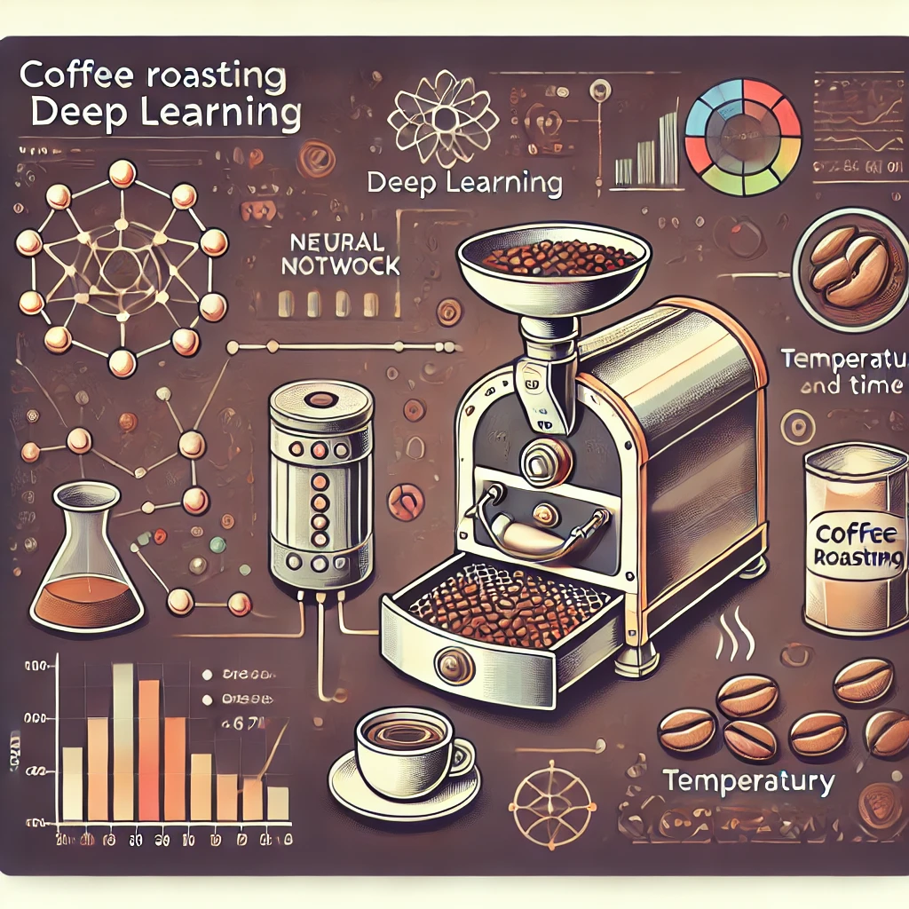

# Coffee Roasting Deep Learning Model

## Introduction

This repository contains a project aimed at revolutionizing the traditional coffee roasting process using advanced machine learning techniques. Coffee roasting is a critical stage in coffee production, where precise control over temperature and time significantly impacts the flavor and quality of the final product. This project leverages deep learning to create a model that predicts the optimal roasting profile for different types of coffee beans.

## Project Overview

Traditional methods of coffee roasting rely heavily on the experience and intuition of the roaster, making it challenging to achieve consistent results. By analyzing historical roasting data, including temperature curves, roast duration, and bean characteristics, our model learns patterns and makes precise predictions. This innovative approach not only automates the coffee roasting process but also allows for greater experimentation and optimization, leading to superior coffee quality.

## Features

- **Data Collection**: Gather various parameters from previous roasting sessions.
- **Data Normalization**: Ensure uniformity by normalizing the data.
- **Data Augmentation**: Enhance the training process by duplicating data to increase the dataset size.
- **Model Building**: Create a neural network specifically designed for coffee roasting.
- **Model Training**: Train the model on the dataset and validate its performance.
- **Model Deployment**: Provide real-time recommendations for adjusting roasting parameters.

## Requirements

- Python 3.7 or higher
- TensorFlow
- Keras
- NumPy
- Pandas
- Matplotlib
- Scikit-learn

## Installation

1. Clone this repository:
   ```sh
   git clone https://github.com/HoomKh/CoffeeRoasting-DeepLearning.git
   cd CoffeeRoasting-DeepLearning
   ```

2. Install the required packages:
   ```sh
   pip install -r requirements.txt
   ```

## Usage

1. **Data Preparation**:
   - Collect and preprocess your data using the provided scripts in the `data` directory.
   - Ensure your data is normalized and augmented appropriately.

2. **Model Training**:
   - Run the Jupyter Notebook `CoffeeRoasting-DeepLearning.ipynb` to train the model.
   - Follow the steps in the notebook to train and validate your model.

3. **Model Deployment**:
   - Use the trained model to make predictions on new data.
   - Apply the `predict` method to obtain real-time recommendations for roasting parameters.

## Notebook Overview

### Data Normalization
Normalizing the input features to ensure they have a similar range, which helps in speeding up the training process.

### Data Augmentation
Duplicating the dataset to artificially increase its size, which enhances the model's learning capabilities.

### Model
Building the "Coffee Roasting Network" with layers and activation functions as described in the lectures.

### Notes on Input Shape and Sigmoid Activation
Explaining the significance of the input shape and the handling of the sigmoid activation in the final layer.

### Compilation and Fitting
Defining the loss function, specifying the optimization algorithm, and running gradient descent to fit the model weights to the data.

### Creating Input Data
Preparing the input data matrix with normalized features and applying the `predict` method.

### Predictions
Using the trained model to make predictions and comparing the probability to a decision threshold.

## Results

The trained model can provide real-time recommendations for adjusting roasting parameters, thereby improving consistency and quality in the coffee roasting process.

## Contributing

We welcome contributions to improve the project. Please fork the repository and create a pull request with your changes.

## License

This project is licensed under the MIT License - see the [LICENSE](LICENSE) file for details.

## Acknowledgments

Special thanks to all the contributors and the community for their valuable feedback and support.

---
